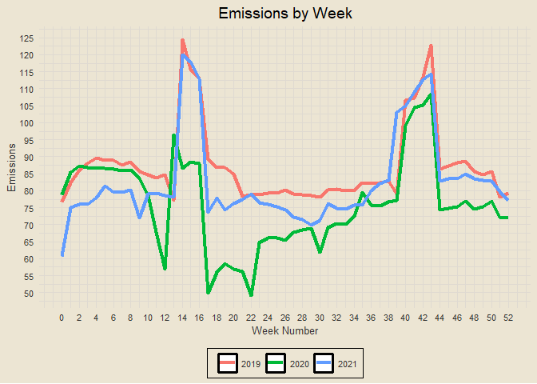
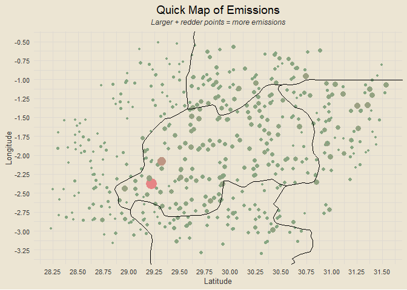

### Loading Packages

### Data Import

``` r
train = read_csv("data/train.csv", col_types = cols())
test = read_csv("data/test.csv", col_types = cols())
sample_submission = read_csv("data/sample_submission.csv", col_types = cols())

paste0(
  "Training data: ",
  nrow(train),
  " rows, ",
  ncol(train),
  " columns"
)
```

    ## [1] "Training data: 79023 rows, 76 columns"

### Finding Missing Data

``` r
paste0(
  "Missing training data percentage: ",
  paste0(round(sum(is.na(train)) / (nrow(train) * ncol(train)) * 100, 2), "%")
)
```

    ## [1] "Missing training data percentage: 16.49%"

``` r
paste0(
  "Missing testing data percentage: ",
  paste0(round(sum(is.na(test)) / (nrow(test) * ncol(test)) * 100, 2), "%")
)
```

    ## [1] "Missing testing data percentage: 17.57%"

### EDA: Emissions by Week

``` r
train |>
  group_by(year, week_no) |>
  summarise(emissions = mean(emission),
            .groups = "drop") |>
  arrange(year, week_no) |>
  add_rowindex() |>
  ggplot(aes(week_no, emissions)) +
  geom_line(aes(col = as.character(year)), linewidth = 1.5) +
  labs(x = "Week Number", y = "Emissions", title = "Emissions by Week", col = NULL) +
  scale_x_continuous(breaks = seq(0, 52, by = 2)) +
  scale_y_continuous(breaks = seq(0, 150, by = 5))
```

<!-- -->

### EDA: Map of Emissions

``` r
world_map = maps::map("world", plot = F, fill = T)
world_map_df = fortify(world_map)

train |>
  group_by(latitude, longitude) |>
  summarise(mean_emissions = mean(emission),
            .groups = "drop") |>
  ggplot() +
  geom_point(aes(x = longitude, y = latitude, col = mean_emissions, size = mean_emissions),
             show.legend = F) +
  geom_polygon(data = world_map_df, aes(x = long, y = lat, group = group),
               fill = "transparent", col = "black") +
  scale_color_gradient(low = "#84A581", high = "#E68585") +
  coord_cartesian(xlim = c(min(train$longitude), max(train$longitude)),
                  ylim = c(min(train$latitude), max(train$latitude))) +
  scale_x_continuous(breaks = seq(25, 35, by = 0.25)) +
  scale_y_continuous(breaks = seq(-4, 0, by = 0.25)) +
  labs(x = "Latitude", y = "Longitude",
       title = "Quick Map of Emissions",
       subtitle = "Larger + redder points = more emissions")
```

<!-- -->
