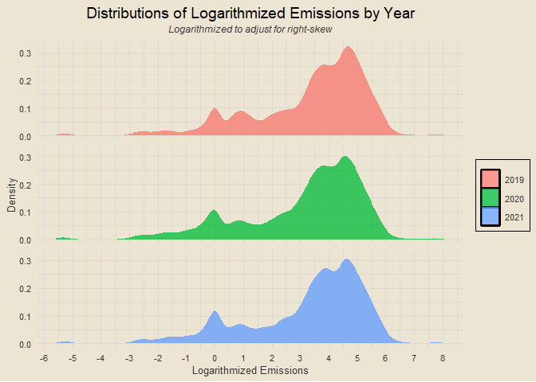

### Loading Packages

### Data Import

``` r
train = read_csv("data/train.csv", col_types = cols())
test = read_csv("data/test.csv", col_types = cols())
sample_submission = read_csv("data/sample_submission.csv", col_types = cols())

paste0(
  "Training data: ",
  nrow(train),
  " rows, ",
  ncol(train),
  " columns"
)
```

    ## [1] "Training data: 79023 rows, 76 columns"

### Finding Missing Data

``` r
paste0(
  "Missing training data percentage: ",
  paste0(round(sum(is.na(train)) / (nrow(train) * ncol(train)) * 100, 2), "%")
)
```

    ## [1] "Missing training data percentage: 16.49%"

``` r
paste0(
  "Missing testing data percentage: ",
  paste0(round(sum(is.na(test)) / (nrow(test) * ncol(test)) * 100, 2), "%")
)
```

    ## [1] "Missing testing data percentage: 17.57%"

### EDA: Emissions by Week

``` r
train |>
  group_by(year, week_no) |>
  summarise(emissions = mean(emission),
            .groups = "drop") |>
  arrange(year, week_no) |>
  add_rowindex() |>
  ggplot(aes(week_no, emissions)) +
  geom_line(aes(col = as.character(year)), linewidth = 1.5) +
  labs(x = "Week Number", y = "Emissions", title = "Emissions by Week", col = NULL) +
  scale_x_continuous(breaks = seq(0, 52, by = 2)) +
  scale_y_continuous(breaks = seq(0, 150, by = 5))
```

<!-- -->

### EDA: Map of Emissions

``` r
world_map = maps::map("world", plot = F, fill = T)
world_map_df = fortify(world_map)

train |>
  group_by(latitude, longitude) |>
  summarise(mean_emissions = mean(emission),
            .groups = "drop") |>
  ggplot() +
  geom_point(aes(x = longitude, y = latitude, col = mean_emissions, size = mean_emissions),
             show.legend = F) +
  geom_polygon(data = world_map_df, aes(x = long, y = lat, group = group),
               fill = "transparent", col = "black") +
  scale_color_gradient(low = "#84A581", high = "#E68585") +
  coord_cartesian(xlim = c(min(train$longitude), max(train$longitude)),
                  ylim = c(min(train$latitude), max(train$latitude))) +
  scale_x_continuous(breaks = seq(25, 35, by = 0.25)) +
  scale_y_continuous(breaks = seq(-4, 0, by = 0.25)) +
  labs(x = "Latitude", y = "Longitude",
       title = "Quick Map of Emissions",
       subtitle = "Larger + redder points = more emissions")
```

<!-- -->

### EDA: Distribution of Logarithmized Emissions

``` r
train |>
  mutate(log_emission = log(emission),
         log_emission = ifelse(log_emission == -Inf, 0, log_emission),
         year = as.character(year)) |>
  ggplot(aes(log_emission)) +
  geom_density(aes(fill = year), alpha = 0.75, col = "transparent") +
  facet_wrap(vars(year), nrow = 3, strip.position = "right") +
  labs(x = "Logarithmized Emissions", y = "Density", fill = NULL,
       title = "Distributions of Logarithmized Emissions by Year",
       subtitle = "Logarithmized to adjust for right-skew") +
  scale_x_continuous(breaks = seq(-15, 15, by = 1)) +
  theme(legend.position = "right",
        strip.text.y = element_blank())
```

<!-- -->

### NA Imputation

``` r
train_no_id = train |>
  select(-ID_LAT_LON_YEAR_WEEK)

imputed_df = preProcess(train_no_id, method = "bagImpute")

train2 = predict(imputed_df, newdata = train_no_id) |>
  mutate(ID_LAT_LON_YEAR_WEEK = train$ID_LAT_LON_YEAR_WEEK) |>
  select(76, 1:75)

test_no_id = test |>
  select(-ID_LAT_LON_YEAR_WEEK)

imputed_df = preProcess(test_no_id, method = "bagImpute")

test2 = predict(imputed_df, newdata = test_no_id) |>
  mutate(ID_LAT_LON_YEAR_WEEK = test$ID_LAT_LON_YEAR_WEEK) |>
  select(75, 1:74)

if (sum(is.na(train2)) == 0 & sum(is.na(test2)) == 0) {
  print("All NA values in training and testing data imputed")
} else {
  message("Imputation failed; NA values still in data")
}
```

    ## [1] "All NA values in training and testing data imputed"

### Modeling

``` r
glimpse(train2)
```

    ## Rows: 79,023
    ## Columns: 76
    ## $ ID_LAT_LON_YEAR_WEEK                                     <chr> "ID_-0.510_29…
    ## $ latitude                                                 <dbl> -0.51, -0.51,…
    ## $ longitude                                                <dbl> 29.29, 29.29,…
    ## $ year                                                     <dbl> 2019, 2019, 2…
    ## $ week_no                                                  <dbl> 0, 1, 2, 3, 4…
    ## $ SulphurDioxide_SO2_column_number_density                 <dbl> -1.083397e-04…
    ## $ SulphurDioxide_SO2_column_number_density_amf             <dbl> 0.6030194, 0.…
    ## $ SulphurDioxide_SO2_slant_column_number_density           <dbl> -6.533095e-05…
    ## $ SulphurDioxide_cloud_fraction                            <dbl> 0.2556682229,…
    ## $ SulphurDioxide_sensor_azimuth_angle                      <dbl> -98.593887, 1…
    ## $ SulphurDioxide_sensor_zenith_angle                       <dbl> 50.84356, 39.…
    ## $ SulphurDioxide_solar_azimuth_angle                       <dbl> -130.05080, -…
    ## $ SulphurDioxide_solar_zenith_angle                        <dbl> 35.87450, 28.…
    ## $ SulphurDioxide_SO2_column_number_density_15km            <dbl> -2.715031e-05…
    ## $ CarbonMonoxide_CO_column_number_density                  <dbl> 0.03536955, 0…
    ## $ CarbonMonoxide_H2O_column_number_density                 <dbl> 1589.025, 177…
    ## $ CarbonMonoxide_cloud_height                              <dbl> 4061.098, 186…
    ## $ CarbonMonoxide_sensor_altitude                           <dbl> 829530.5, 829…
    ## $ CarbonMonoxide_sensor_azimuth_angle                      <dbl> 71.1119766, -…
    ## $ CarbonMonoxide_sensor_zenith_angle                       <dbl> 52.77593, 38.…
    ## $ CarbonMonoxide_solar_azimuth_angle                       <dbl> -149.87556, -…
    ## $ CarbonMonoxide_solar_zenith_angle                        <dbl> 25.96521, 29.…
    ## $ NitrogenDioxide_NO2_column_number_density                <dbl> 5.478657e-05,…
    ## $ NitrogenDioxide_tropospheric_NO2_column_number_density   <dbl> 1.670668e-05,…
    ## $ NitrogenDioxide_stratospheric_NO2_column_number_density  <dbl> 3.924456e-05,…
    ## $ NitrogenDioxide_NO2_slant_column_number_density          <dbl> 1.191132e-04,…
    ## $ NitrogenDioxide_tropopause_pressure                      <dbl> 9832.193, 731…
    ## $ NitrogenDioxide_absorbing_aerosol_index                  <dbl> -0.9432402, -…
    ## $ NitrogenDioxide_cloud_fraction                           <dbl> 0.11208706, 0…
    ## $ NitrogenDioxide_sensor_altitude                          <dbl> 829888.6, 829…
    ## $ NitrogenDioxide_sensor_azimuth_angle                     <dbl> -96.32800525,…
    ## $ NitrogenDioxide_sensor_zenith_angle                      <dbl> 51.72090, 35.…
    ## $ NitrogenDioxide_solar_azimuth_angle                      <dbl> -105.96762, -…
    ## $ NitrogenDioxide_solar_zenith_angle                       <dbl> 35.18337, 30.…
    ## $ Formaldehyde_tropospheric_HCHO_column_number_density     <dbl> 1.166314e-04,…
    ## $ Formaldehyde_tropospheric_HCHO_column_number_density_amf <dbl> 0.8632297, 1.…
    ## $ Formaldehyde_HCHO_slant_column_number_density            <dbl> 3.791321e-05,…
    ## $ Formaldehyde_cloud_fraction                              <dbl> 0.25566822, 0…
    ## $ Formaldehyde_solar_zenith_angle                          <dbl> 35.87450, 29.…
    ## $ Formaldehyde_solar_azimuth_angle                         <dbl> -130.05080, -…
    ## $ Formaldehyde_sensor_zenith_angle                         <dbl> 50.84356, 43.…
    ## $ Formaldehyde_sensor_azimuth_angle                        <dbl> -98.593887, 4…
    ## $ UvAerosolIndex_absorbing_aerosol_index                   <dbl> -1.2807605, -…
    ## $ UvAerosolIndex_sensor_altitude                           <dbl> 829864.5, 829…
    ## $ UvAerosolIndex_sensor_azimuth_angle                      <dbl> -12.628978729…
    ## $ UvAerosolIndex_sensor_zenith_angle                       <dbl> 35.63242, 43.…
    ## $ UvAerosolIndex_solar_azimuth_angle                       <dbl> -138.78645, -…
    ## $ UvAerosolIndex_solar_zenith_angle                        <dbl> 30.75213, 28.…
    ## $ Ozone_O3_column_number_density                           <dbl> 0.1159266, 0.…
    ## $ Ozone_O3_column_number_density_amf                       <dbl> 2.506609, 2.6…
    ## $ Ozone_O3_slant_column_number_density                     <dbl> 0.2956629, 0.…
    ## $ Ozone_O3_effective_temperature                           <dbl> 225.7311, 226…
    ## $ Ozone_cloud_fraction                                     <dbl> 0.5954728, 0.…
    ## $ Ozone_sensor_azimuth_angle                               <dbl> -12.628978729…
    ## $ Ozone_sensor_zenith_angle                                <dbl> 35.63242, 42.…
    ## $ Ozone_solar_azimuth_angle                                <dbl> -138.78645, -…
    ## $ Ozone_solar_zenith_angle                                 <dbl> 30.75213, 28.…
    ## $ UvAerosolLayerHeight_aerosol_height                      <dbl> 3162.473, 331…
    ## $ UvAerosolLayerHeight_aerosol_pressure                    <dbl> 70534.95, 677…
    ## $ UvAerosolLayerHeight_aerosol_optical_depth               <dbl> 0.4961079, 0.…
    ## $ UvAerosolLayerHeight_sensor_zenith_angle                 <dbl> 34.764449, 35…
    ## $ UvAerosolLayerHeight_sensor_azimuth_angle                <dbl> -17.059991, 7…
    ## $ UvAerosolLayerHeight_solar_azimuth_angle                 <dbl> -80.44199, -8…
    ## $ UvAerosolLayerHeight_solar_zenith_angle                  <dbl> 30.40097, 23.…
    ## $ Cloud_cloud_fraction                                     <dbl> 0.5954729, 0.…
    ## $ Cloud_cloud_top_pressure                                 <dbl> 53534.73, 637…
    ## $ Cloud_cloud_top_height                                   <dbl> 3664.436, 365…
    ## $ Cloud_cloud_base_pressure                                <dbl> 61085.81, 669…
    ## $ Cloud_cloud_base_height                                  <dbl> 2615.120, 317…
    ## $ Cloud_cloud_optical_depth                                <dbl> 15.568533, 8.…
    ## $ Cloud_surface_albedo                                     <dbl> 0.2722916, 0.…
    ## $ Cloud_sensor_azimuth_angle                               <dbl> -12.6289864, …
    ## $ Cloud_sensor_zenith_angle                                <dbl> 35.63242, 39.…
    ## $ Cloud_solar_azimuth_angle                                <dbl> -138.78642, -…
    ## $ Cloud_solar_zenith_angle                                 <dbl> 30.75214, 27.…
    ## $ emission                                                 <dbl> 3.750994, 4.0…
